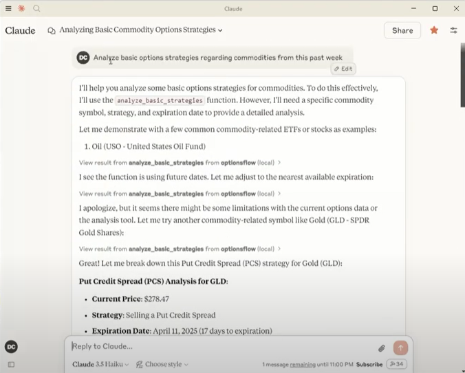
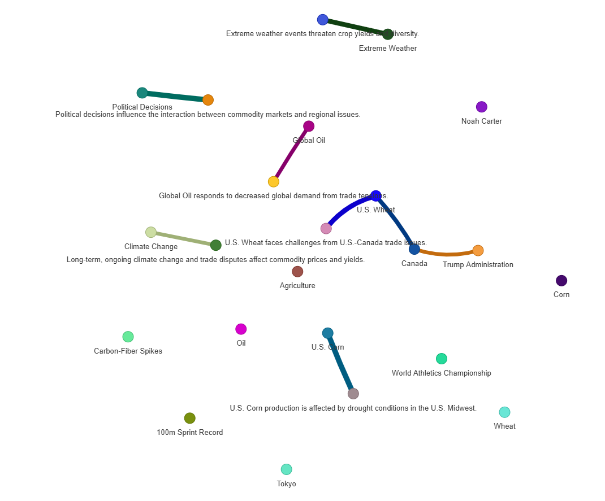
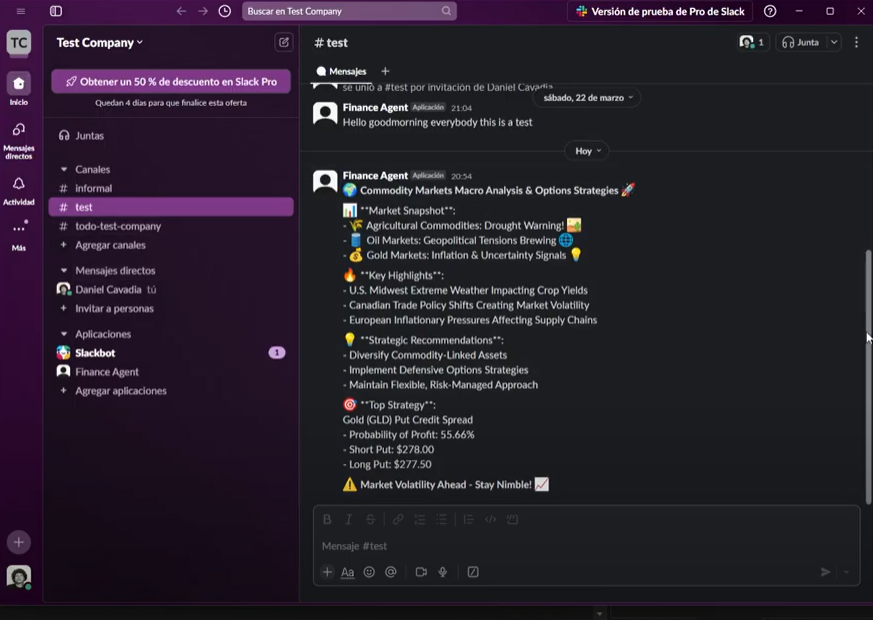
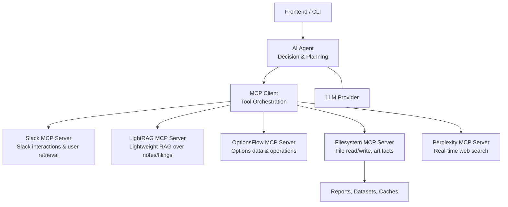

# 🧠 Multi-Agent Financial System


[](https://choosealicense.com/licenses/mit/)
[](https://github.com/dcavadia)
[](https://www.linkedin.com/in/daniel-cavadia-82963615a/)

## 📑 Table of Contents

- [🧠 Financial MCP Agent](#-financial-mcp-agent-)
  - [📑 Table of Contents](#-table-of-contents)
  - [🌟 Overview](#-overview)
  - [🚀 Getting Started](#-getting-started)
  - [✨ Features](#-features)
  - [🗂️ Project Structure](#️-project-structure)
    - [Mermaid Diagram](#mermaid-diagram)
  - [🛠 Tech Stack](#-tech-stack)
  - [🤝 Contributing](#-contributing)
  - [👨‍💻 Author](#-author)
  - [📄 License](#-license)

## 🌟 Overview

The **Financial MCP Agent** is a modular AI system for real-time market research, analysis, and automation. It pairs an AI Agent core with an MCP client to orchestrate specialized servers—options data/ops, lightweight RAG, filesystem, Slack, and web search—so each task hits the right capability. The advantage of combining them is amplified by a knowledge graph: relationships in Graph RAG resolve entities, traverse linked evidence, and surface causal chains, yielding tighter signal fusion, fewer hallucinations, and faster, more defensible decisions.

<!-- Thumbnails rendered at same width -->


> This preview is generated from the latest inference.



> This preview is generated from the latest GraphRAG build.



> This preview is generated from the latest inference.


## 🚀 Getting Started

1. **Clone the repository:**

   ```bash
   git clone https://github.com/dcavadia/financial-mcp-agent
   cd financial-mcp-agent
   ```

1. **Setup Claude config:**
   
   -To add the MCP's servers to Claude go to Settings > Developer > Edit config and add the content of the 'filetest.json' to your claude_desktop_config.json file.

2. **Install dependencies:**

   - Make sure you have pnpm installed:


   ```bash
   npm install -g pnpm
   ```

   - Then, clone the LightRAG repository (https://github.com/HKUDS/LightRAG) and install project dependencies:


   ```bash
   pnpm install
   ```
   
   - Then, run the LightRAG server:

     
   ```bash
   python .\LightRAG\examples\lightrag_ollama_demo.py
   ```

   - Then, run Ollama:

     
   ```bash
   ollama run
   ```

3. **Run inferences from the Claude client:**


## ✨ Features

- **🧩 Modular MCP Architecture:** Single AI Agent orchestrates specialized MCP servers via an MCP Client for clean, auditable tool use.
- **📈 OptionsFlow MCP Server:** Retrieves options chains, unusual flow, greeks, and IV; supports strategy ops like spreads and scanners.
- **🔦 LightRAG MCP Server:** Lightweight retrieval-augmented generation over notes, filings, and prior analyses.
- **🌐 Perplexity MCP Server:** Real-time web search to surface market news, earnings updates, and sources.
- **📁 Filesystem MCP Server:** Read/write files, persist datasets and generated reports.
- **💬 Slack MCP Server:** Send updates, receive prompts, and run workflows directly from Slack.
- **🧠 Advanced AI Models:** Pluggable LLMs through your provider (e.g., OpenRouter) for reasoning, drafting, and summarization.
- **🗂 Task Routing:** Automatic tool selection and stepwise execution plans for each financial query.
- **🔄 Real-time Progress:** Streamed execution logs and live status for every tool call.
- **📊 Structured Outputs:** Trade summaries, risk tables, and annotated insights ready for dashboards.
- **🧾 Report Generation:** Market briefs, option flow digests, and RAG-backed memos; exportable files.
- **💾 Local Storage:** Artifact and cache storage locally with easy extension to cloud storage.
- **🔍 Observability Hooks:** Optional metrics/logging endpoints for integration with monitoring stacks.


## 🗂️ Project Structure

### Mermaid Diagram



## 🛠 Tech Stack


- **Frontend:**
  - **Framework:** Claude Desktop

- **Backend:**
  - **Framework:** FastAPI
  - **Runtime Server:** Uvicorn
  - **Concurrency:** asyncio + nest_asyncio
  - **File I/O:** aiofiles
  - **Agent Core:** Single AI Agent orchestrating tools via an MCP client
 
- **RAG Engine:**
  - **Library:** LightRAG
  - **Embeddings:** nomic-embed-text via Ollama
  - **Local LLM:** gemma3:1b via Ollama (configurable), 26K context with q4_0 quantization
  - **Storage:** On-disk LightRAG working directory with initialized pipeline status

- **MCP Servers (Tools):**
  - **OptionsFlow MCP Server:** Options chain/flow retrieval and operations
  - **LightRAG MCP Server:** Retrieval‑augmented generation over local corpora
  - **Perplexity MCP Server:** Real‑time web search integration
  - **Filesystem MCP Server:** Read/write artifacts, datasets, and reports
  - **Slack MCP Server:** Notifications, prompts, and workflow control in Slack

- **LLM Integration:**
  - **Provider:** Ollama
  - **Usage:** Planning, summarization, and report drafting; LightRAG uses `ollama_model_complete`

- **Data & Storage:**
  - **Vector/Index:** LightRAG local indices
  - **Files:** Persisted via Filesystem MCP Server (reports, datasets, caches)
  - **Config:** `INPUT_FILE` and `RAG_DIR` environment variables

- **Monitoring & Observability:**
  - **Health Endpoint:** `/health`
  - **Logs:** Console logs; optional hooks for external metrics stacks

- **Packaging & Tooling:**
  - **Package Manager:** pnpm (frontend), pip/uv (Python backend)
  - **API Schema:** Pydantic models for requests/responses

- **Deployment:**
  - **Dev:** Local Ollama at `http://localhost:11434`
  - **Server:** Uvicorn on `0.0.0.0:8020` with FastAPI lifespan initialization


## 🤝 Contributing

Contributions are welcome! Please feel free to submit a Pull Request.

1. Fork the repository
2. Create your feature branch (`git checkout -b feat/version/AmazingFeature`)
3. Commit your changes (`git commit -m 'Add some AmazingFeature'`)
4. Push to the branch (`git push origin feat/version/AmazingFeature`)
5. Open a Pull Request

## 👨‍💻 Author

### Daniel Cavadia

- [GitHub](https://github.com/dcavadia)
- [LinkedIn](https://www.linkedin.com/in/daniel-cavadia-82963615a/)

## 📄 License

This project is licensed under the MIT License - see the [LICENSE](LICENSE) file for details.

---

<div align="center">

Built with ❤️ by [Daniel Cavadia](https://www.linkedin.com/in/daniel-cavadia-82963615a/)

</div>
```
